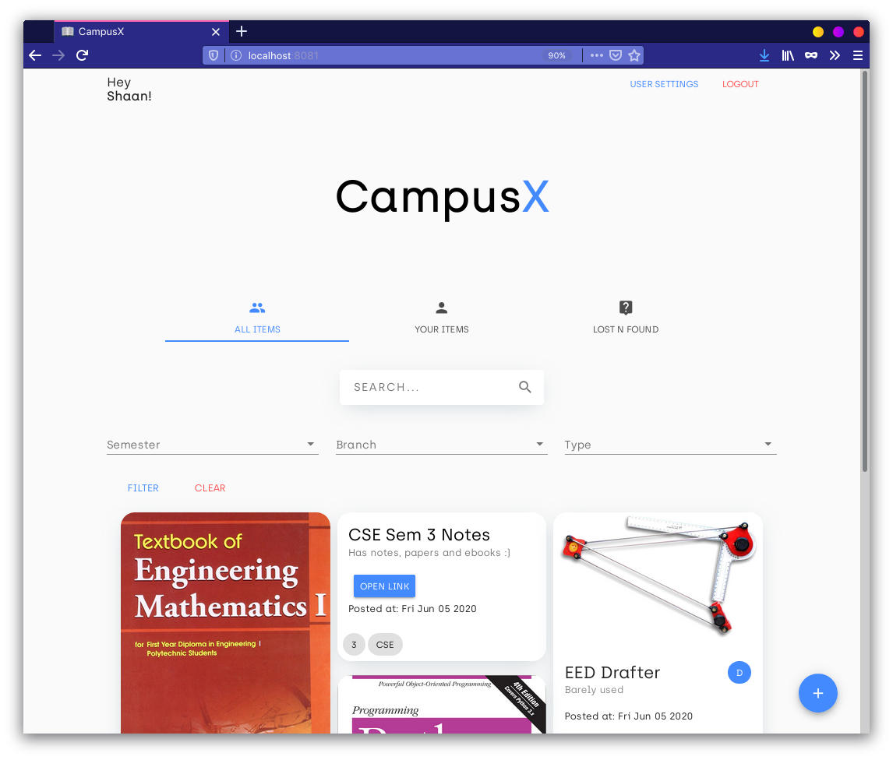
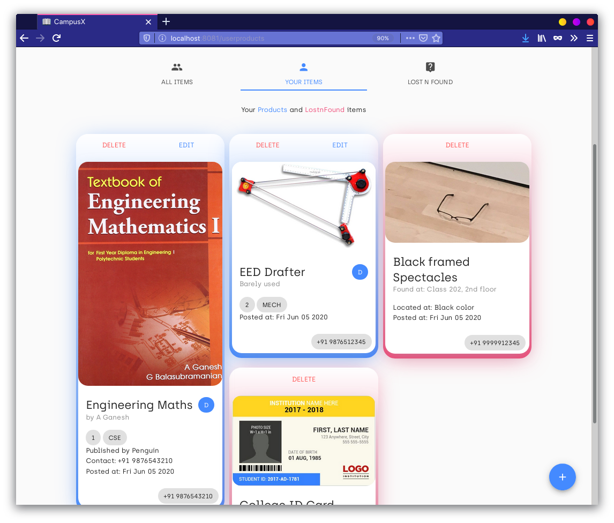
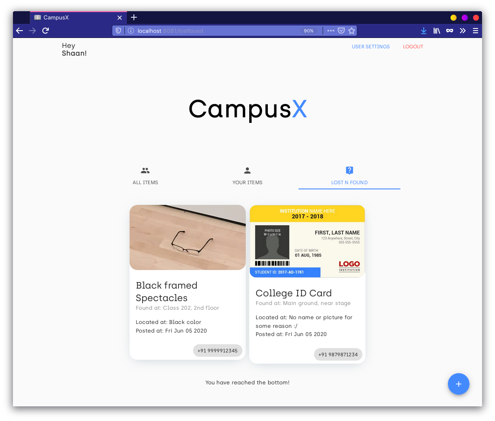

# CampusX - Frontend

---
## Preview

### Screenshots

---
## Getting started

To get the Node server running locally:
- Clone this repo
- `npm install` to install all required dependencies
- `npm run serve` will compile and hot-reload for development

>`npm run build` Compiles and minifies for production.
>`npm run lint` Lints and fixes files.

See [Configuration Reference](https://cli.vuejs.org/config/).

---
## Code Overview

### Dependencies
- [expressjs](https://github.com/expressjs/express) - The server for handling and routing HTTP requests 
- [vue](https://github.com/vuejs/vue) - JS Framework used for building the UI
- [vue-material](https://github.com/vuematerial/vue-material) - For material themed assets like buttons, inputs, etc.
- [axios](https://github.com/axios/axios) - Promise based HTTP client for the browser and node.js
---
